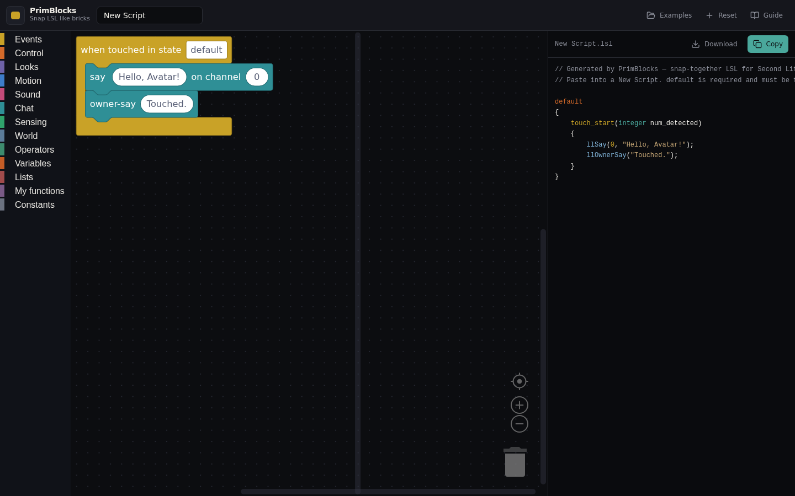
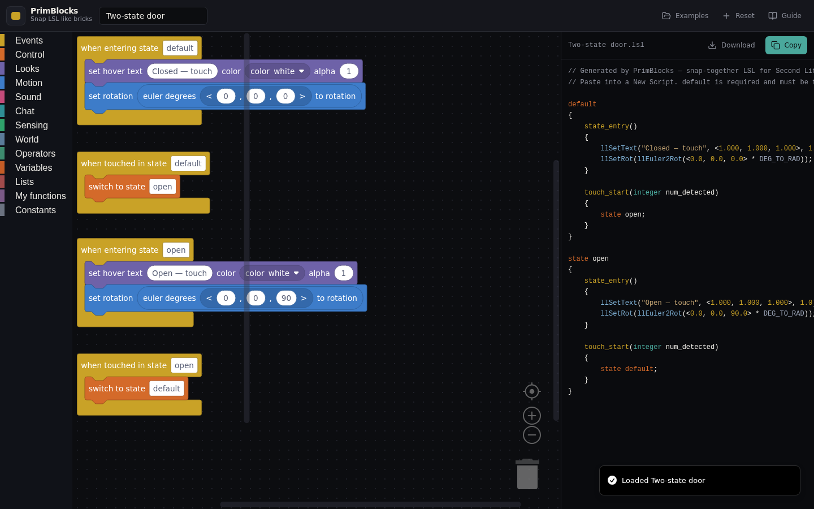
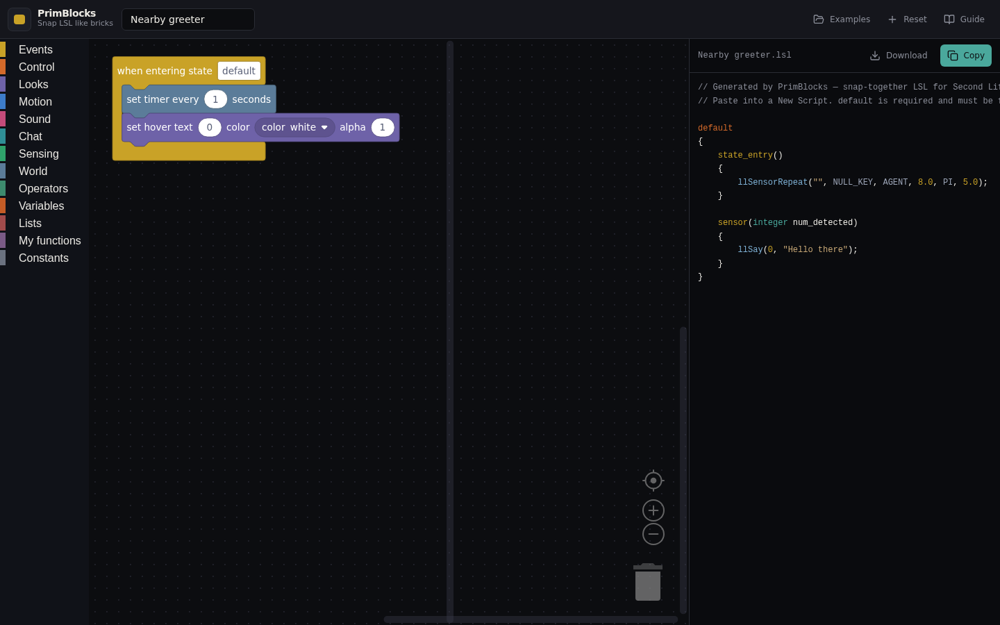
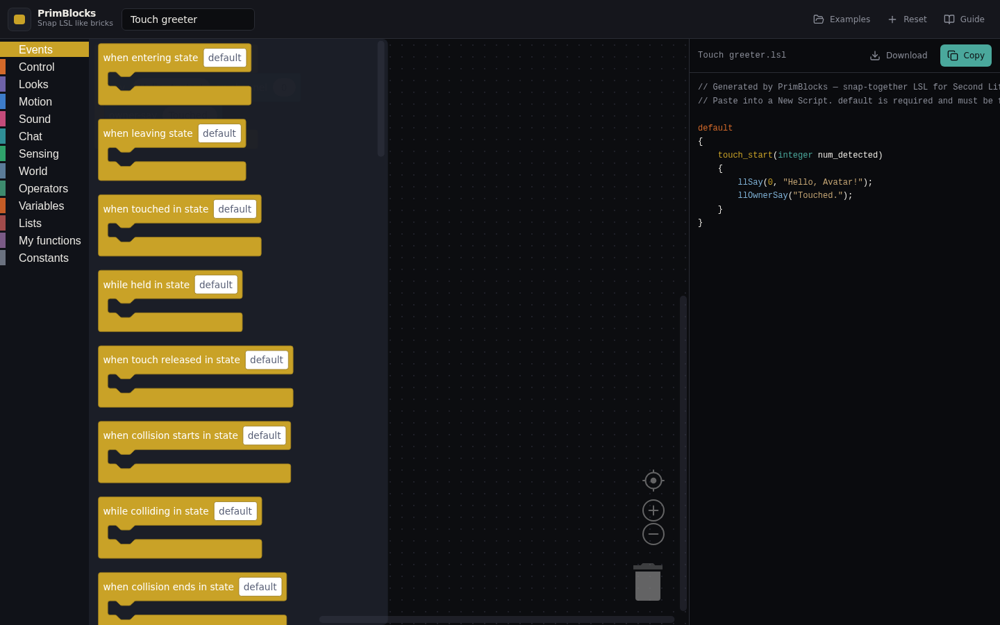
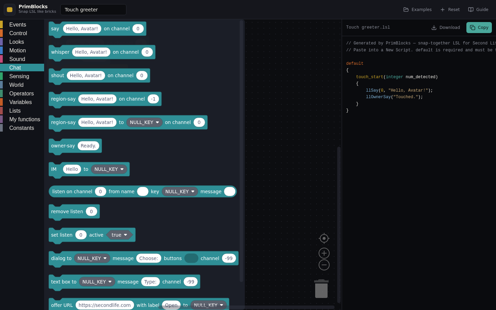
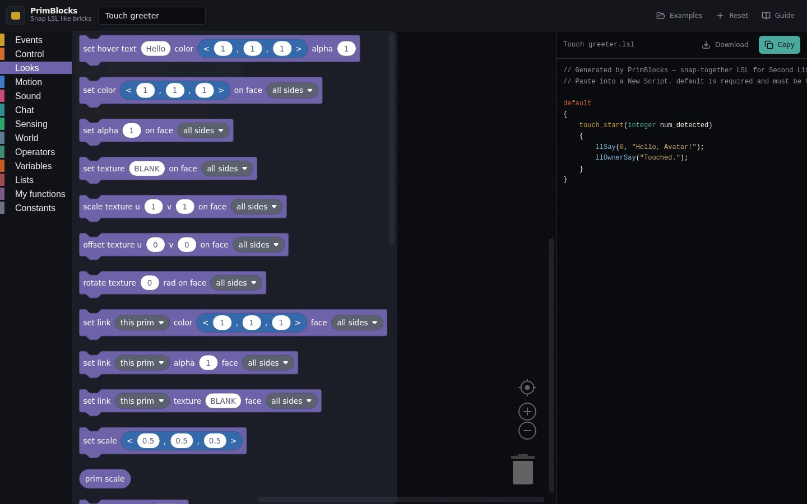
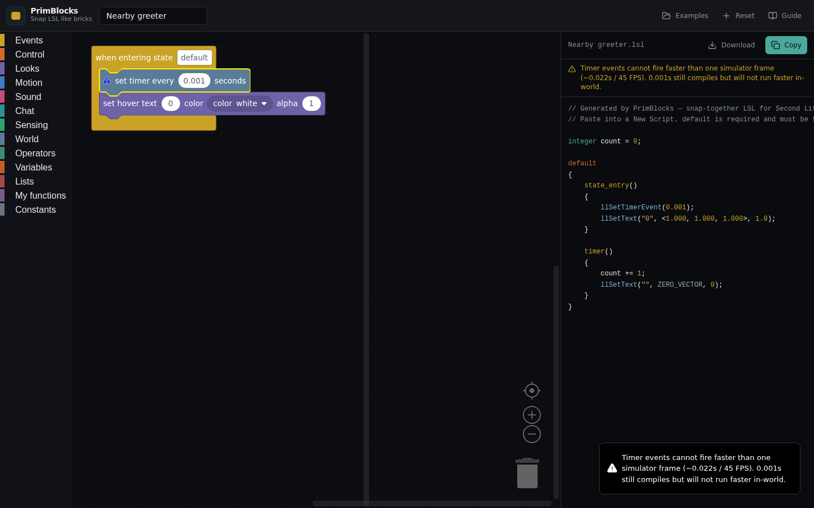
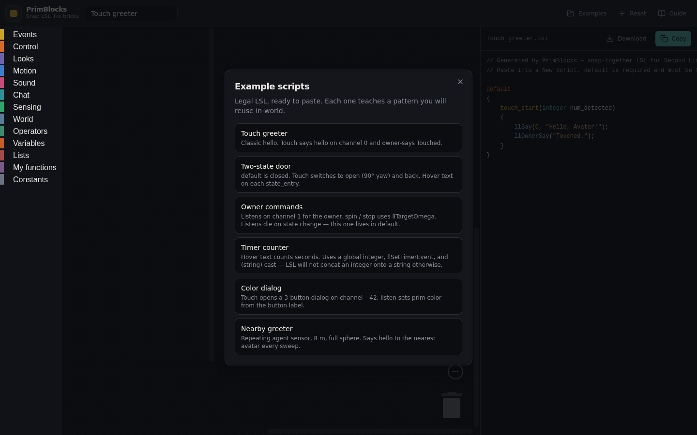
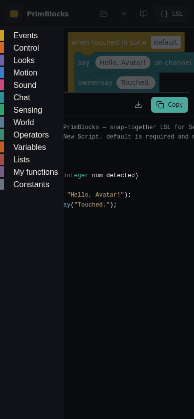

# PrimBlocks

Browser editor that snaps LSL like LEGO Mindstorms / Scratch, then dumps a real Linden Scripting Language script you paste into a Second Life prim.

**Version:** `0.1.0`

Yellow hats are events. Teal/colored command bricks stack under them. The panel on the right is the compiled `.lsl` — not a sketch.

Not a full LSL IDE. The catalog is the events + the ll* calls you actually use for greeters, doors, listens, dialogs, sensors, particles, and the usual sensing/world helpers. Raw LSL bricks cover the rest.

Second Life / LSL are Linden Lab trademarks. This is not affiliated with Linden Lab.

## Features

- **Zelos bricks** — Blockly 13, Mindstorms-style C-hats, colored categories
- **Legal compilation units** — `default` always first, typed globals, no `void`, `for` index declared outside the `for`
- **Official event signatures** — `touch_start(integer num_detected)`, `listen(integer channel, string name, key id, string message)`, etc.
- **ll* catalog** — chat, looks, motion, sound, sensing, world, lists, math. Wiki link on every brick tooltip
- **Type snaps** — integer will plug into a float socket, not the other way around. String + number needs a cast brick
- **Warnings** — sensor range, chat bytes, timer faster than a sim frame, forced delays (IM 2s, dialog 1s, `llSetPos` 0.2s)
- **Examples** — greeter, two-state door, timer counter, owner commands, dialog, nearby sensor
- **localStorage** — workspace + script name survive a refresh. Nothing is uploaded

## Screenshots

Editor (desktop):

| Greeter | Door | Timer |
| --- | --- | --- |
|  |  |  |

Toolbox (Events / Chat / Looks):

| Events | Chat | Looks |
| --- | --- | --- |
|  |  |  |

Warnings + phone:

| Timer too fast | Dialog delay | Phone LSL sheet |
| --- | --- | --- |
|  |  |  |

Full set (every flyout, every example, guide, variable dialog): [docs/SCREENSHOTS.md](docs/SCREENSHOTS.md).

_Refresh these under `docs/screenshots/` when user-visible UI changes promote (or when Overlord asks)._

## Quick start

```bat
npm install
npm run dev
```

Opens on port 5173. Copy the script → in SL: Build → Script → New Script → replace the stub → Save.

```bat
npm test
npm run typecheck
```

## How it compiles

1. Yellow hats are top-level. Each hat has a **state** field (`default` unless you are doing a door / vendor / etc).
2. Commands under a hat become the event body.
3. Variables become typed globals (`integer count = 0;`, `key id = NULL_KEY;`, …).
4. User-function bricks emit above states. LSL will not let a function change state — don't put a state brick in one.
5. `assembleScript()` writes: comments → globals → functions → `default` → other states alphabetically.

Details: [docs/LSL.md](docs/LSL.md). Code map: [docs/ARCHITECTURE.md](docs/ARCHITECTURE.md). What to look at: [docs/REVIEW.md](docs/REVIEW.md).

## Docs

| File | What |
|---|---|
| [docs/REVIEW.md](docs/REVIEW.md) | Review order, easy-to-break generator rules, known gaps |
| [docs/SCREENSHOTS.md](docs/SCREENSHOTS.md) | Full screenshot gallery |
| [docs/LSL.md](docs/LSL.md) | LSL rules this editor actually encodes |
| [docs/ARCHITECTURE.md](docs/ARCHITECTURE.md) | Files, generator pipeline, adding a brick |
| [docs/CATALOG.md](docs/CATALOG.md) | Event + ll* table generated from source (`npm run catalog`) |
| [docs/EXAMPLES.md](docs/EXAMPLES.md) | The six bundled scripts and what they should emit |
| [docs/EXTENDING.md](docs/EXTENDING.md) | How to add an ll* brick without touching the generator by hand |

## Branching

- **`dev`** — day-to-day work (this dump lives here).
- **`main`** — only when you say **promote**.

See [BRANCHING.md](BRANCHING.md).

## License / notes

Personal / local use. Early `0.1.0` track — catalog is not every ll* on the wiki. Hover a brick for the wiki signature. Forced delays and in-world caps warn; they still compile because the simulator is what actually sleeps / clamps.
