# Screenshots

Refresh these under `docs/screenshots/` when user-visible UI changes promote (or when Overlord asks).

Captured against the standalone Vite app at 1440×900 (desktop) and 390×844 (phone). Blockly flyouts are the left toolbox; the right column is live LSL.

## Editor — bundled examples

| Touch greeter | Two-state door | Timer counter |
| --- | --- | --- |
|  |  |  |

| Owner commands | Color dialog | Nearby greeter |
| --- | --- | --- |
|  |  | 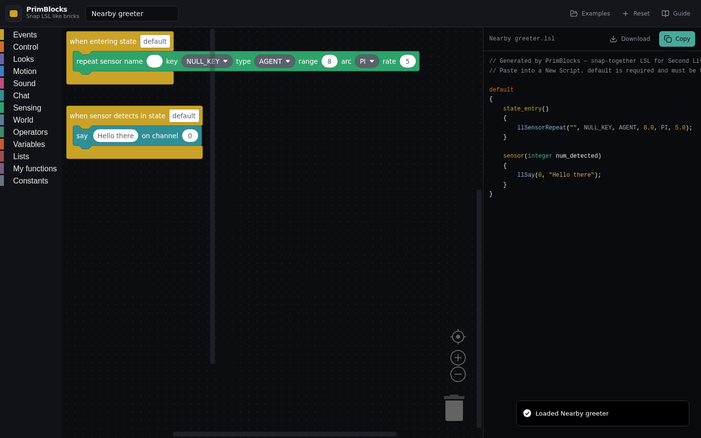 |

| Notecard greeter |
| --- |
| 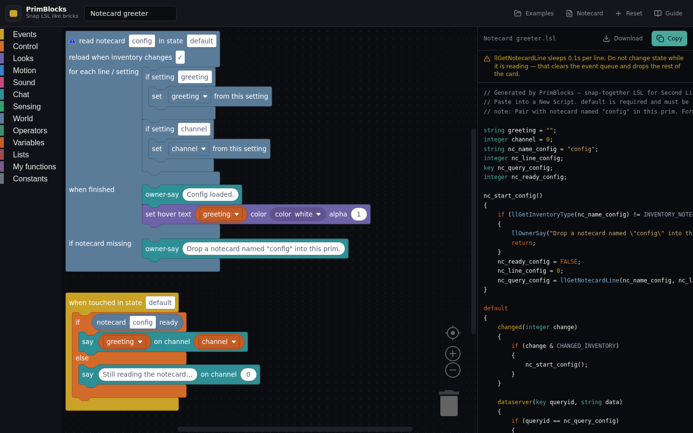 |

What to check in those:

- **Greeter** — `touch_start` hat, `llSay` + `llOwnerSay` stacked, no missing next-block.
- **Door** — `default` then `state open` in the panel. Euler → `llEuler2Rot(... * DEG_TO_RAD)`.
- **Counter** — global `integer count`, `(string)` cast on the hover text.
- **Listen** — owner-filtered `llListen`, `if` / `else if` on `spin` / `stop`.
- **Dialog** — `llDialog` 1s delay warning in the panel. Still compiles.
- **Sensor** — `llSensorRepeat` 8 m / `AGENT` / `PI`, `sensor` event.
- **Notecard** — World hat (not a real LSL event). Panel on the right has `nc_start_config`, `dataserver` NAK/EOF, `CHANGED_INVENTORY`, `touch_start` gated on `nc_ready_config`. Pair with the Notecard dialog.

## Dialogs

| Examples | Guide |
| --- | --- |
| 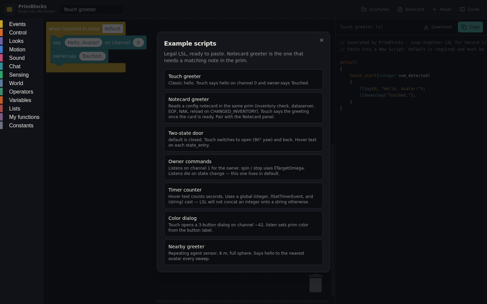 | 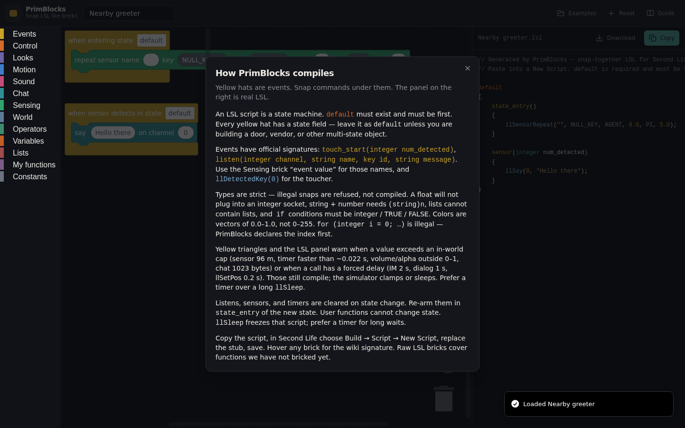 |

| Create variable | Notecard builder |
| --- | --- |
| 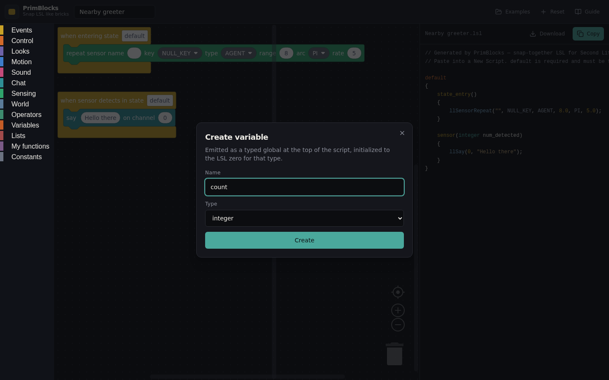 | 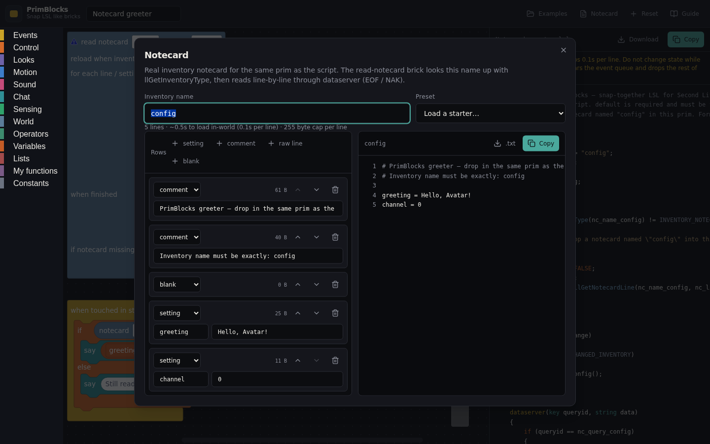 |

## Toolbox flyouts

Yellow hats first, then control C-blocks, then the ll\* categories. Constants are the grey dropdowns at the bottom of the toolbox.

| Events | Control | Looks |
| --- | --- | --- |
|  | 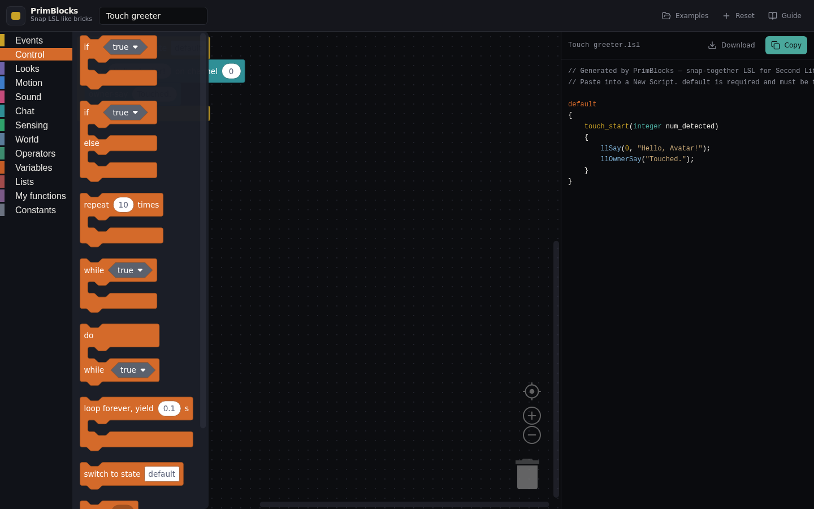 |  |

| Motion | Sound | Chat |
| --- | --- | --- |
| 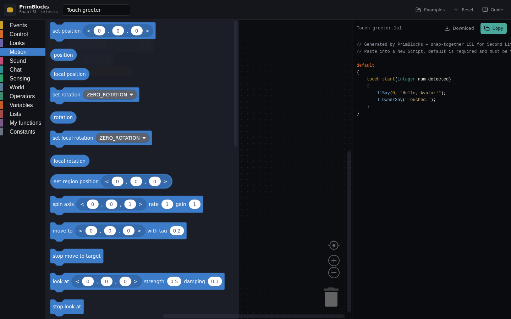 | 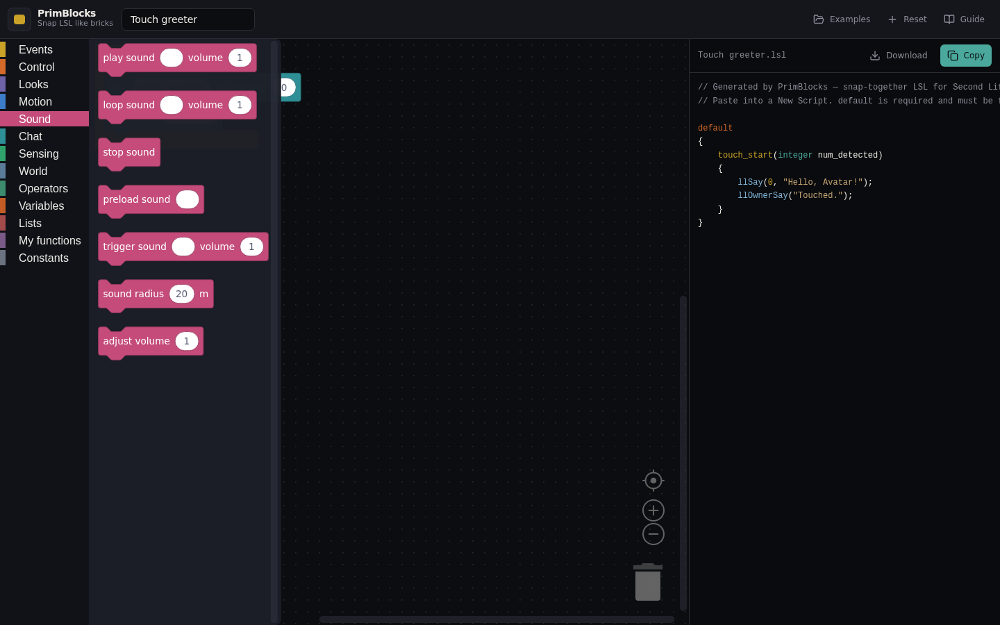 |  |

| Sensing | World | Operators |
| --- | --- | --- |
| 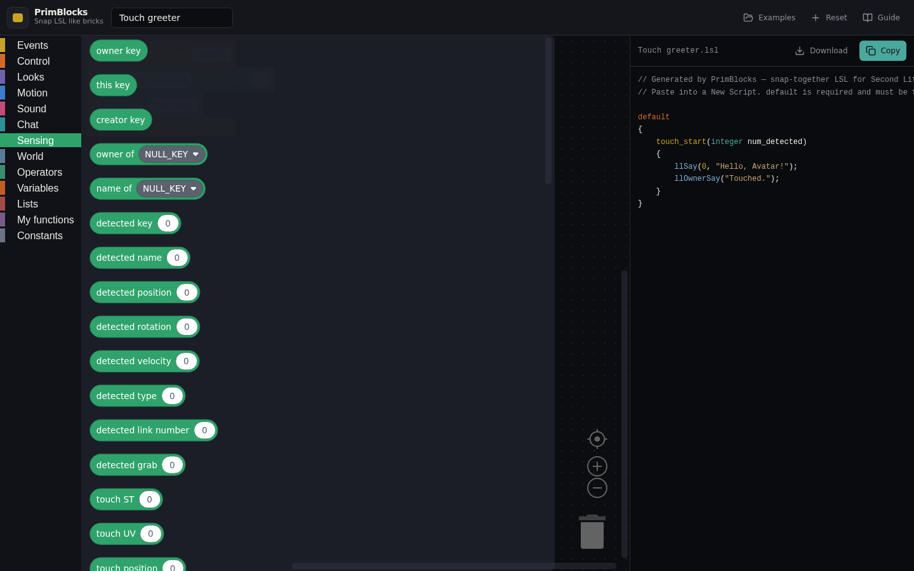 | 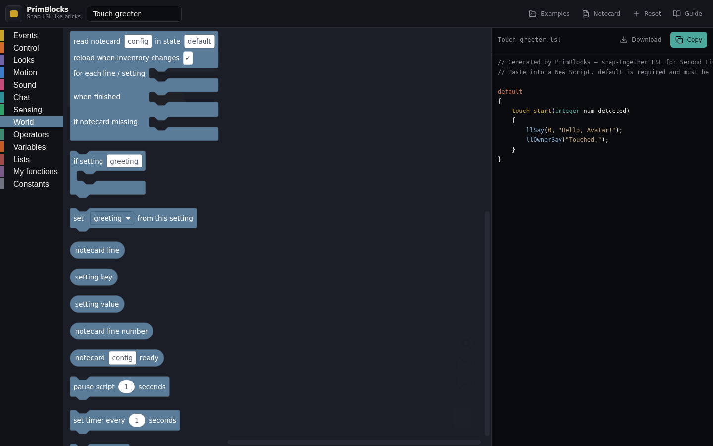 | 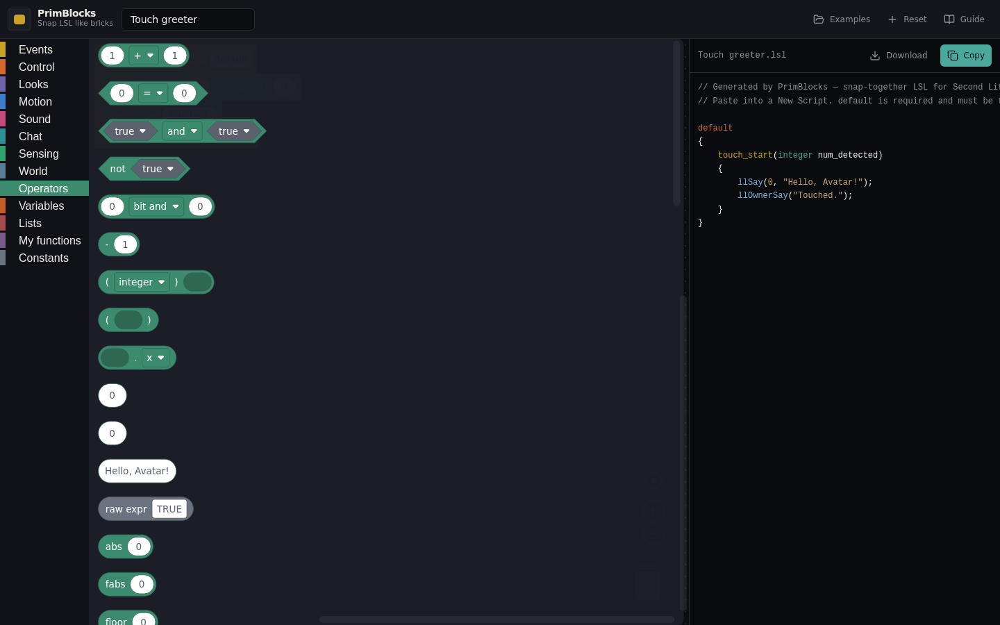 |

| Variables | Lists | My functions | Constants |
| --- | --- | --- | --- |
| 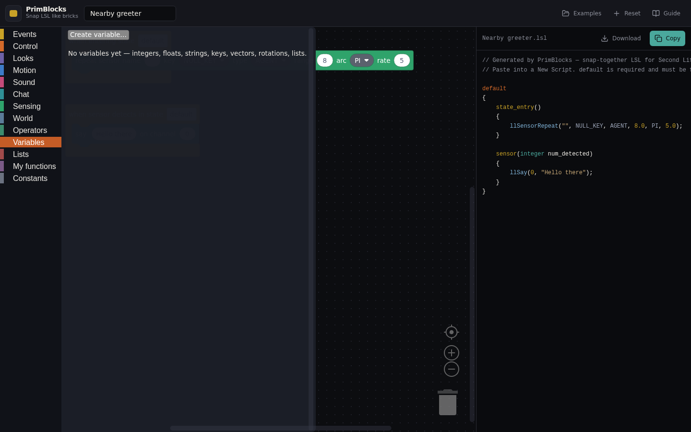 | 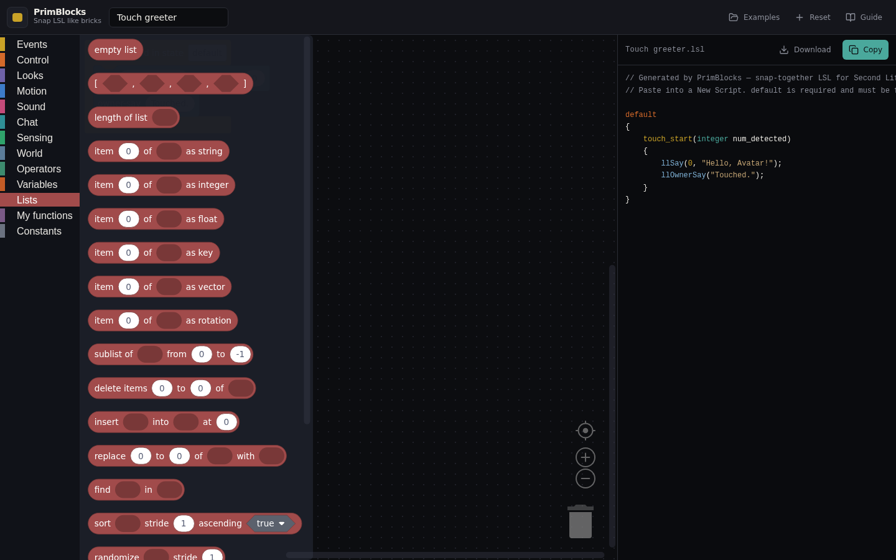 | 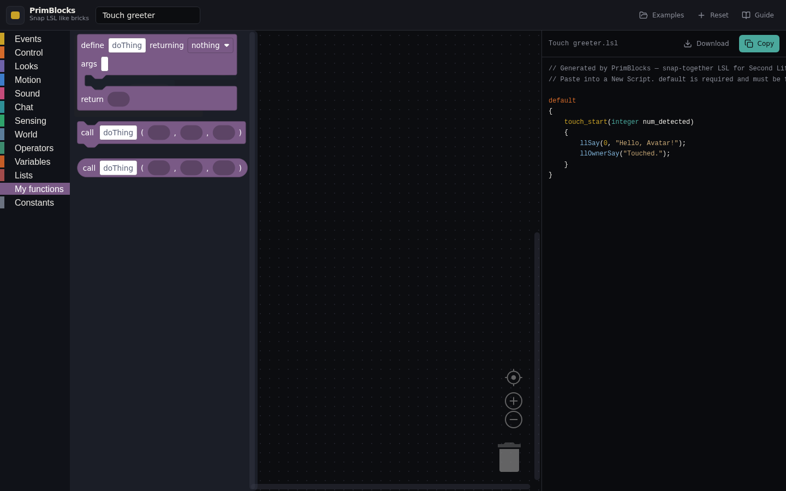 | 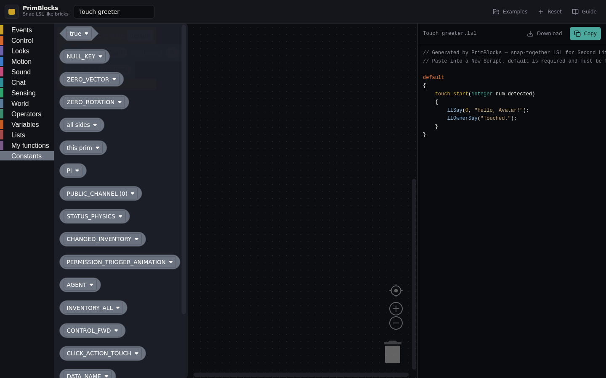 |

## Warnings

Yellow triangles on the brick + a strip above the LSL. Errors (region-say channel 0, etc.) go red. These two are the ones people actually hit.

| Timer faster than a sim frame | Dialog forced delay |
| --- | --- |
|  |  |

`warn-timer.png` is the counter example with the interval set to `0.001`. The script still emits `llSetTimerEvent(0.001)` — the sim will not honor that.

## Phone

Header buttons collapse; LSL is a bottom sheet.

| Workspace | LSL sheet |
| --- | --- |
| 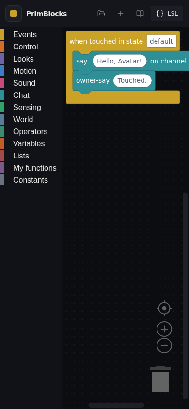 |  |

## File names

| File | What |
|---|---|
| `editor-*.png` | Full desktop chrome, example loaded |
| `flyout-*.png` | Toolbox category open |
| `dialog-*.png` | Modal |
| `warn-*.png` | Limit / delay UI |
| `mobile-*.png` | 390×844 |
